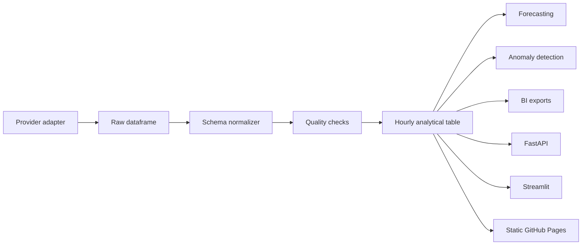

# Architecture

## Design principle

The core analytics layer must continue to run when any external provider is unavailable. Provider adapters translate external schemas into one normalized hourly model. Downstream cleaning, analytics, APIs, visualizations and BI exports depend only on the normalized model.

## Provider modes

1. `demo` — deterministic synthetic data for immediate execution and CI.
2. `local` — user-owned CSV, XLSX or Parquet data.
3. `teias-catalog` — discovery of public TEİAŞ monthly electricity report links.
4. `epias` — optional authenticated near-real-time data using the user's own credentials.

## Data flow

## Security

- Secrets are read from environment variables.
- `.env` and private raw-data folders are ignored by Git.
- EPİAŞ TGT values are held in memory only and refreshed before expiration.
- No credential is written to logs, reports or exported datasets.
